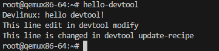

# Yocto Project

## Build and run virtual images with QEMU, create layer and Hello World

* Run Hello World app

## Build recipe using devtool

* Recipe directory

* Run recipe app

## Package dependencies and splitting in Yocto

* Dependency directory

* Deploy apps to QEMU virtual image

* Run apps
* Before add "bash" dependency

* After add "bash" dependency

* Run package split

## Build SDK using Yocto

* Build SDK

* Install SDK

* Run app complied by SDK on QEMU image

## Build image for Raspberry Pi Zero 2 W

* Build image

(Not yet confirm on Raspberry Pi Zero 2 W)

